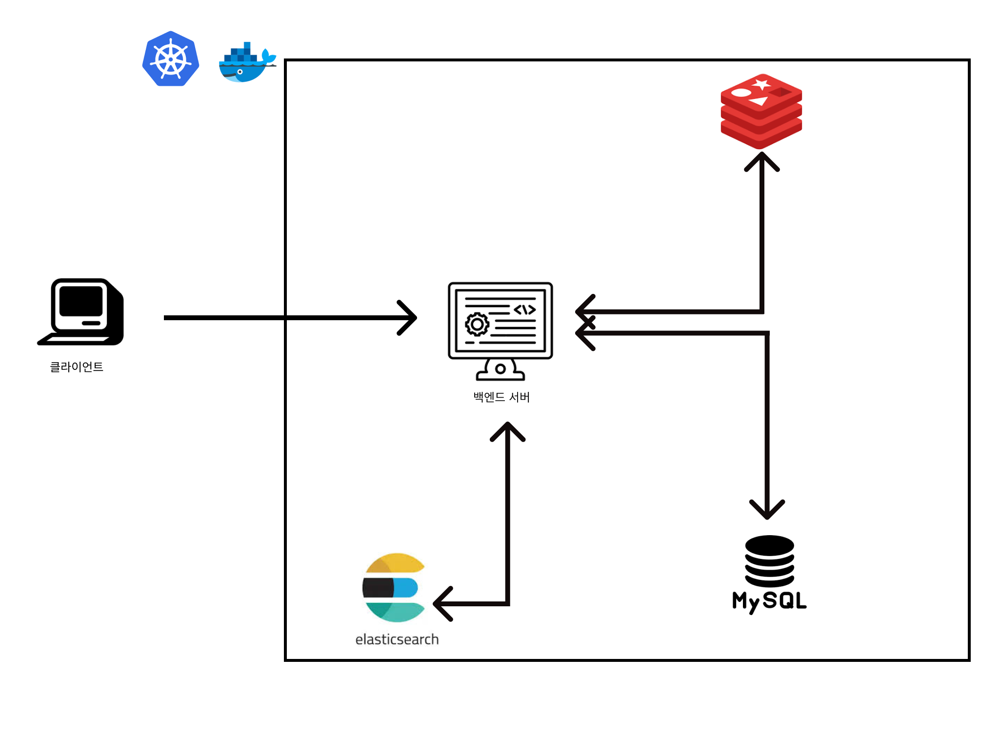

## 프로젝트

## Getting Started

----
요구사항 분석

[유저 대기열](docs/유저_대기열.md)

[예약 가능 날짜](docs/날짜_예약_좌석.md)

[좌석 예약 요청](docs/좌석_예약_요청.md)

[잔액 충전 / 조회](docs/잔액_충전과_조회.md)

[결재 API](docs/결재.md)

### Prerequisites

#### Running Docker Containers

`local` profile 로 실행하기 위하여 인프라가 설정되어 있는 Docker 컨테이너를 실행해주셔야 합니다.

```bash
docker-compose up -d
```


## 다이어그램

### ERD 


### 스퀸스


## 인프라 구성도


클라이언트에서 콘서트 예약 사이트에 접근
콘서트 정보, 예약에 필요한 사용자 정보들을 DB에서 가져온다.

콘서트 예약을 위한 대기열 접근 시 대기열에 대한 정보를 DB에서 계속 가져올려면 비용이 증가하여
Redis를 이용해 대기열을 캐시에 넣어서 비용 감소

엘라스틱 서치에서 로그들을 관리하여 오류, 문제가 발생할 때 해당 문제를 보고 수정 
